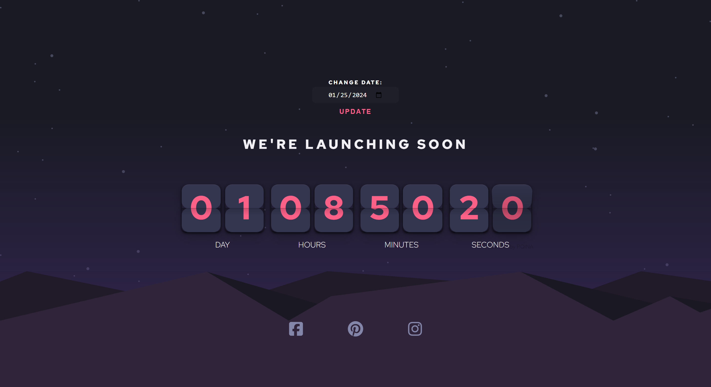

# Launch Countdown Timer - Intermediate Frontend Mentor Challenge

## Description

This is an intermediate Frontend Mentor challenge of a countdown timer with a "flip clock" animation. The project was built using HTML, SCSS, JavaScript, and the Vite build tool, with a focus on creating a simple but multi-layered CSS design.

The countdown timer uses the [pqina flip counter plugin](https://pqina.nl/flip/) to create a visually appealing countdown to a launch date. An additional feature of this project is the ability for users to change the launch date. This is done through an input field that accepts a date, which updates the countdown timer in real time.

## Screenshots

### Desktop View

## Getting Started

### Prerequisites

- [Node.js and npm](https://nodejs.org/) installed on your machine.
- [Vite](https://vitejs.dev/guide/) installed globally on your machine.
- Basic knowledge of HTML, SCSS, and JavaScript.
- Familiarity with the [pqina flip counter plugin](https://pqina.nl/flip/).

### Installation

1. Clone this repository to your local machine or download the files as a zip.
2. Navigate to the project directory.
3. Run `npm install` to install the project dependencies, including Vite.
4. Run `npm run dev` to start the Vite development server. This will also automatically open the project in your default web browser.

## Usage

This project does have interactive features such as the ability to update the launch date in real time. However, it is mainly viewed as a static HTML and SCSS project. To view the project, simply run `npm run dev` in the project directory. This will start the Vite development server and open the project in your web browser.

If you want to build the project for production, run `npm run build`. This will create a `dist` directory with the built files.

## Contributing

This project is a simple practice project and is not currently accepting contributions.

## License

This project is licensed under the MIT License - see the `LICENSE.md` file for details.

## Contact

For any questions or concerns, please contact Juan Lagunas at dev.jlagunas@gmail.com.
